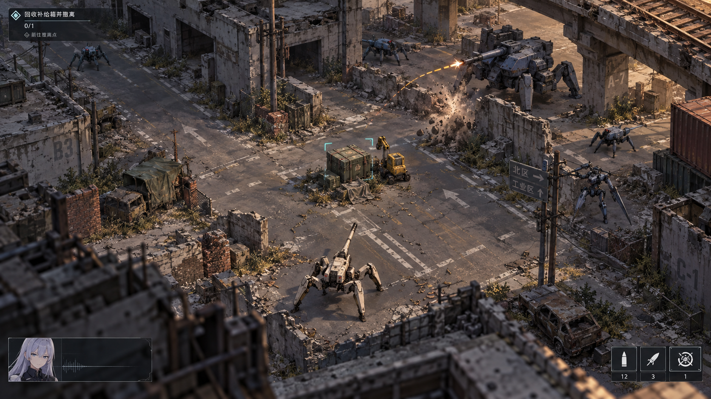

# 灰燼歸路：美術目標與 MVP

2026-09-13。美術圖是風格目標，MVP 沿用既有 2D 素材，兩者並非同一完成度。

主頁選「灰燼歸路」即可試玩。WASD 移動、滑鼠瞄準、自動開火、左鍵機型技能、右鍵躍進、Space 支援；到回收點按 E 開始／取消。主要物資完成後，進入北側出口自動結算。西側救援可選。

這是短玩法原型，不是已完成的完整章節：8 個有限遭遇敵機、1 張地圖、固定 M1A4；熟悉路線可迅速繞行完成。完整時長、敵軍調度與美術細節留待本輪回饋。

先驗收三件事：能否理解目標；回收中斷與繞行是否有意義；救援是否值得冒險。既有無限／直線模式仍可從同一主頁進入。

詳見 [Sprint 紀錄](../../docs/superpowers/plans/2026-09-13-ash-return.md)。
